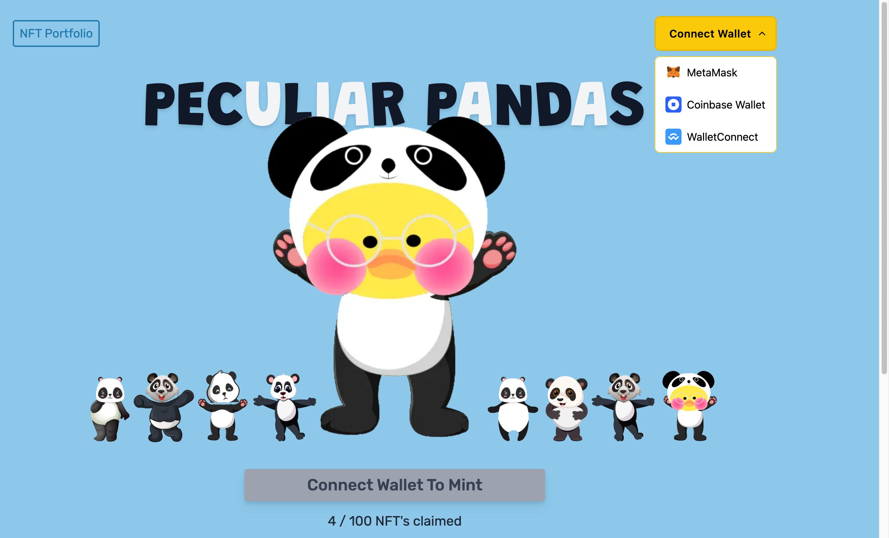
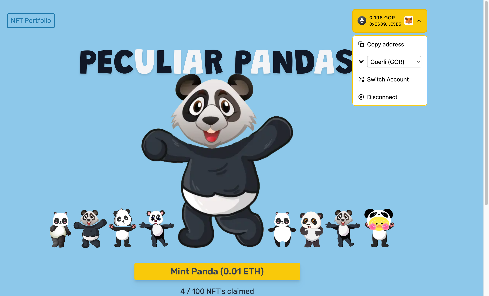
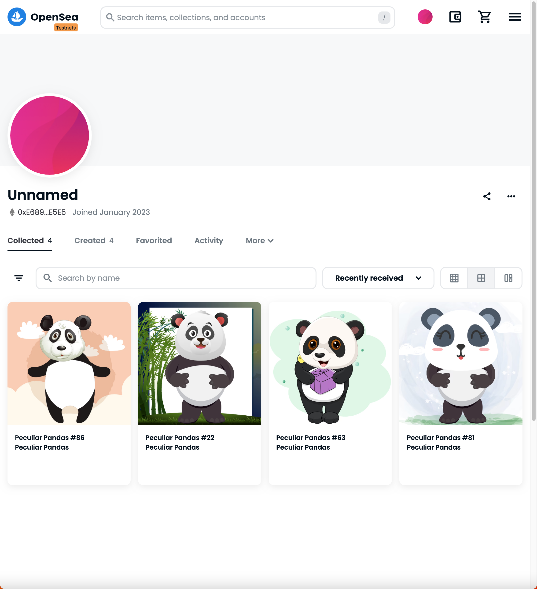
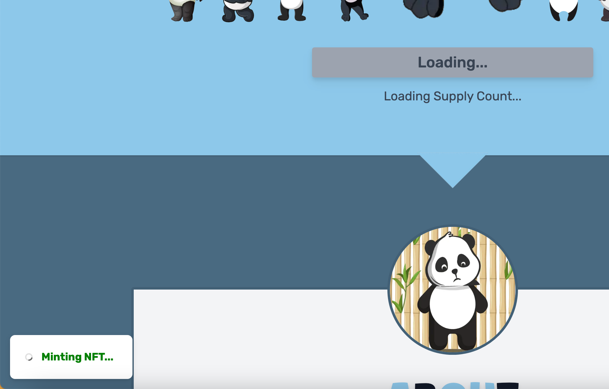
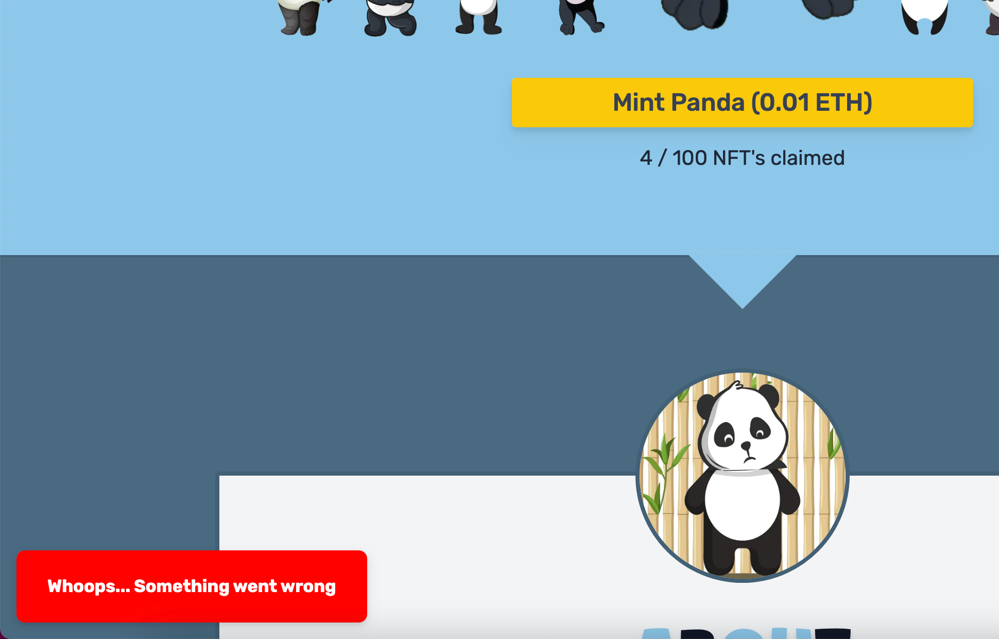
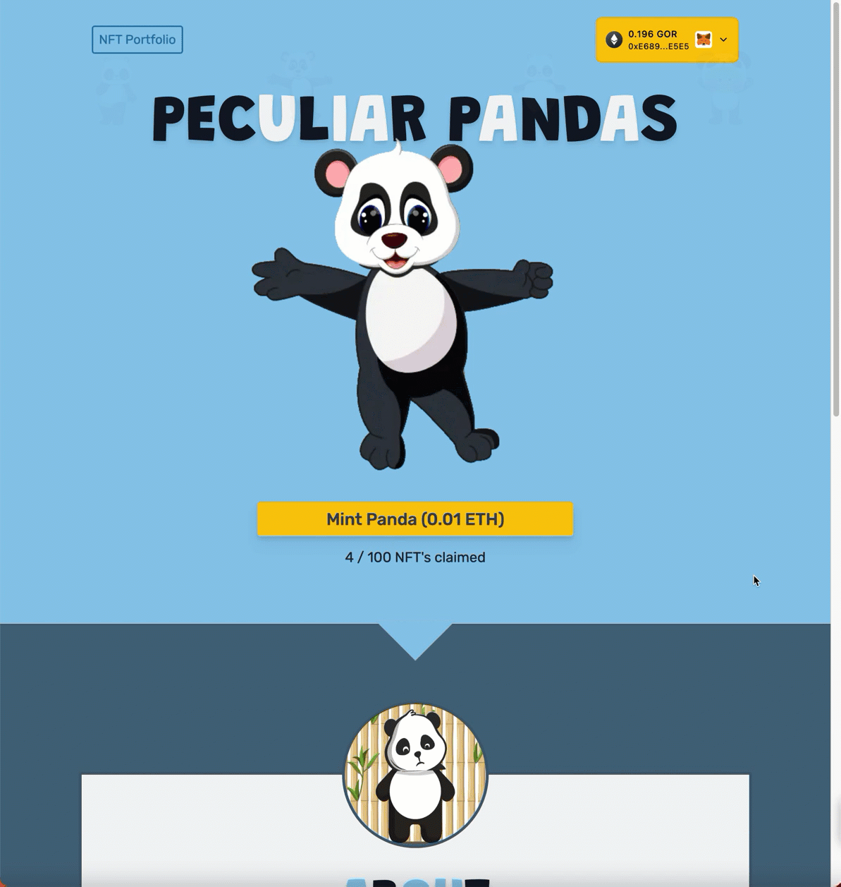
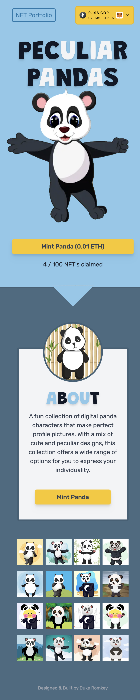
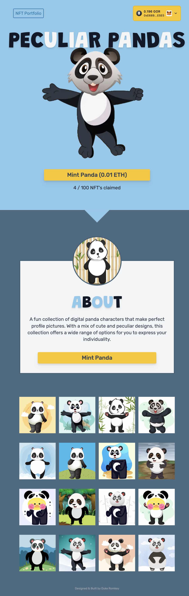

# Peculiar Pandas

   
  <h5>See large version: https://app.screencast.com/YFPJirvO7seR5</h5>

## Technologies

- Client
  - React, TypeScript, TailwindCSS, Framer Motion, React Hot Toast,  
- Smart Contract
  - thirdweb
- Server Side Rendering
  - Next.js
- CMS
  - Sanity.io

## Features
1. <strong>Connect to Multiple Wallets</strong> - Ability to connect to MetaMask, Coinbase Wallet, or WalletConnect.

  

 
2. <strong>Mint on Ethereum Test Network (Goerli)</strong> - Each wallet can mint up to 5 Peculiar Panda NFTs on the Goerli Ethereum test network.

   
  

 
 
3. <strong>Instantly viewable NFTs on OpenSea</strong> - View your NFT right after mint on the OpenSea Testnet (https://testnets.opensea.io/).

   
  

 
 
4. <strong>Instructional User Interface</strong> - Dynamically prompt user to connect to wallet in order to mint. Will notify users when smart contract information is loading, when NFTs are being minted, and also if minting process was unsuccessful.

   
  
  

 
 
5. <strong>Dynamically updated mint price and NFT's claimed</strong> - Mint price and number of NFTs claimed will dynamically update based off the Thirdweb smart contract.

 
 
6. <strong>Animations for enhanced user experience</strong> - Fun animations to enhance the user experience and enjoyment on the site.

   
  
  

 
 
7. <strong>Mobile responsive design</strong> - Variations in layout, animations, and images to be responsive in mobile, tablets, and large screen devices for todays users.

   
  
  
  

 

## Creator and Designer
Duke Romkey
